# 🚀 Guía Completa de Implementación de Microservicios con Spring Boot

## 📋 Tabla de Contenidos
1. [Arquitectura Detallada](#arquitectura-detallada)
2. [Patrones de Diseño](#patrones-de-diseño)
3. [Implementaciones Específicas](#implementaciones-específicas)
4. [Manejo de Errores](#manejo-de-errores)
5. [Configuraciones Avanzadas](#configuraciones-avanzadas)

## 🏗 Arquitectura Detallada

### Diagrama de Arquitectura General


### Diagrama de Flujo de Solicitudes


## 🎯 Patrones de Diseño

### 1. Circuit Breaker Pattern


#### Implementación Detallada
```java
/**
 * Configuración del Circuit Breaker con Resilience4j
 */
@Configuration
public class CircuitBreakerConfig {
    
    @Bean
    public CircuitBreakerRegistry circuitBreakerRegistry() {
        CircuitBreakerConfig config = CircuitBreakerConfig.custom()
            .failureRateThreshold(50)
            .waitDurationInOpenState(Duration.ofMillis(1000))
            .slidingWindowSize(2)
            .build();
            
        return CircuitBreakerRegistry.of(config);
    }
}

/**
 * Servicio que implementa Circuit Breaker
 */
@Service
@Slf4j
public class ResilientProductService {
    
    private final CircuitBreaker circuitBreaker;
    private final ProductRepository productRepository;
    
    public ResilientProductService(CircuitBreakerRegistry registry,
                                 ProductRepository productRepository) {
        this.circuitBreaker = registry.circuitBreaker("productService");
        this.productRepository = productRepository;
    }
    
    public Product getProduct(String id) {
        return circuitBreaker.executeSupplier(() -> {
            log.info("Intentando obtener producto: {}", id);
            return productRepository.findById(id)
                .orElseThrow(() -> new ProductNotFoundException(id));
        });
    }
}
```

### 2. Saga Pattern para Transacciones Distribuidas

```mermaid
sequenceDiagram
    participant O as Order Service
    participant P as Payment Service
    participant I as Inventory Service
    participant S as Shipping Service

    O->>P: Iniciar Pago
    P-->>O: Pago Confirmado
    O->>I: Reservar Inventario
    I-->>O: Inventario Reservado
    O->>S: Crear Envío
    S-->>O: Envío Creado
```



#### Implementación
```java
/**
 * Orquestador de Saga para proceso de checkout
 */
@Service
@Slf4j
public class CheckoutSagaOrchestrator {
    
    private final PaymentService paymentService;
    private final InventoryService inventoryService;
    private final ShippingService shippingService;
    
    @Transactional
    public CheckoutResult processCheckout(CheckoutRequest request) {
        try {
            // 1. Procesar Pago
            PaymentResult payment = paymentService.processPayment(request.getPaymentDetails());
            
            // 2. Reservar Inventario
            InventoryResult inventory = inventoryService.reserveProducts(request.getProducts());
            
            // 3. Crear Envío
            ShippingResult shipping = shippingService.createShipment(request.getShippingDetails());
            
            return new CheckoutResult(payment, inventory, shipping);
            
        } catch (Exception e) {
            // Compensación en caso de fallo
            compensateFailedCheckout(request);
            throw new CheckoutFailedException("Fallo en el proceso de checkout", e);
        }
    }
    
    private void compensateFailedCheckout(CheckoutRequest request) {
        // Lógica de compensación
        log.error("Iniciando compensación para checkout fallido");
        // Implementar rollback de operaciones
    }
}
```

## 🔧 Configuraciones Detalladas

### 1. Configuración de Eureka Server

```yaml
# application.yml para Eureka Server
server:
  port: 8761

spring:
  application:
    name: eureka-server
  
eureka:
  instance:
    hostname: localhost
  client:
    registerWithEureka: false
    fetchRegistry: false
    serviceUrl:
      defaultZone: http://${eureka.instance.hostname}:${server.port}/eureka/
  server:
    enableSelfPreservation: false
    eviction-interval-timer-in-ms: 1000
```

### 2. Configuración de API Gateway

```yaml
# application.yml para API Gateway
spring:
  cloud:
    gateway:
      routes:
        - id: products-service
          uri: lb://products-service
          predicates:
            - Path=/api/products/**
          filters:
            - name: CircuitBreaker
              args:
                name: productsCircuitBreaker
                fallbackUri: forward:/fallback/products
            - name: RequestRateLimiter
              args:
                redis-rate-limiter.replenishRate: 10
                redis-rate-limiter.burstCapacity: 20
            - name: RetryFilter
              args:
                retries: 3
                statuses: BAD_GATEWAY
                methods: GET
                backoff:
                  firstBackoff: 50ms
                  maxBackoff: 500ms
                  factor: 2
                  basedOnPreviousValue: false
```

## 🛠 Manejo de Errores Avanzado

### 1. Estructura de Errores
```java
/**
 * Estructura base para errores
 */
@Getter
@AllArgsConstructor
public class ApiError {
    private HttpStatus status;
    private String message;
    private List<String> errors;
    private LocalDateTime timestamp;
    private String path;
    
    @JsonFormat(shape = JsonFormat.Shape.STRING, pattern = "dd-MM-yyyy HH:mm:ss")
    public LocalDateTime getTimestamp() {
        return timestamp;
    }
}
```

### 2. Manejador Global de Excepciones
```java
/**
 * Manejador global de excepciones para toda la aplicación
 */
@RestControllerAdvice
@Slf4j
public class GlobalExceptionHandler extends ResponseEntityExceptionHandler {

    @ExceptionHandler(ProductNotFoundException.class)
    public ResponseEntity<ApiError> handleProductNotFound(
            ProductNotFoundException ex,
            WebRequest request) {
        
        log.error("Producto no encontrado: {}", ex.getMessage());
        
        ApiError apiError = new ApiError(
            HttpStatus.NOT_FOUND,
            ex.getMessage(),
            Collections.singletonList("Producto no encontrado"),
            LocalDateTime.now(),
            request.getDescription(false)
        );
        
        return new ResponseEntity<>(apiError, HttpStatus.NOT_FOUND);
    }
    
    @ExceptionHandler(CircuitBreakerException.class)
    public ResponseEntity<ApiError> handleCircuitBreakerException(
            CircuitBreakerException ex,
            WebRequest request) {
            
        log.error("Circuit Breaker activado: {}", ex.getMessage());
        
        ApiError apiError = new ApiError(
            HttpStatus.SERVICE_UNAVAILABLE,
            "Servicio temporalmente no disponible",
            Collections.singletonList(ex.getMessage()),
            LocalDateTime.now(),
            request.getDescription(false)
        );
        
        return new ResponseEntity<>(apiError, HttpStatus.SERVICE_UNAVAILABLE);
    }
    
    @ExceptionHandler(Exception.class)
    public ResponseEntity<ApiError> handleAllUncaughtException(
            Exception ex,
            WebRequest request) {
            
        log.error("Error no controlado: ", ex);
        
        ApiError apiError = new ApiError(
            HttpStatus.INTERNAL_SERVER_ERROR,
            "Ha ocurrido un error interno",
            Collections.singletonList(ex.getMessage()),
            LocalDateTime.now(),
            request.getDescription(false)
        );
        
        return new ResponseEntity<>(apiError, HttpStatus.INTERNAL_SERVER_ERROR);
    }
}
```

### 3. Manejo de Errores en Circuit Breaker
```java
/**
 * Configuración personalizada de Circuit Breaker
 */
@Configuration
public class CustomCircuitBreakerConfig {
    
    @Bean
    public Customizer<Resilience4JCircuitBreakerFactory> defaultCustomizer() {
        return factory -> factory.configureDefault(id -> new Resilience4JConfigBuilder(id)
            .circuitBreakerConfig(CircuitBreakerConfig.custom()
                .slidingWindowSize(10)
                .failureRateThreshold(50)
                .waitDurationInOpenState(Duration.ofMillis(10000))
                .permittedNumberOfCallsInHalfOpenState(3)
                .slowCallRateThreshold(50)
                .slowCallDurationThreshold(Duration.ofSeconds(2))
                .build())
            .timeLimiterConfig(TimeLimiterConfig.custom()
                .timeoutDuration(Duration.ofSeconds(3))
                .build())
            .build());
    }
}
```

## 📊 Monitoreo y Métricas

### 1. Configuración de Actuator
```yaml
# application.yml
management:
  endpoints:
    web:
      exposure:
        include: "*"
  endpoint:
    health:
      show-details: always
    metrics:
      enabled: true
    prometheus:
      enabled: true
  metrics:
    tags:
      application: ${spring.application.name}
```

### 2. Métricas Personalizadas
```java
/**
 * Configuración de métricas personalizadas
 */
@Configuration
public class MetricsConfig {
    
    @Bean
    MeterRegistry meterRegistry() {
        return new SimpleMeterRegistry();
    }
    
    @Bean
    public Counter requestCounter(MeterRegistry registry) {
        return Counter.builder("http.requests.total")
            .description("Total HTTP Requests")
            .register(registry);
    }
}

/**
 * Interceptor para métricas HTTP
 */
@Component
@RequiredArgsConstructor
public class MetricsInterceptor implements HandlerInterceptor {
    
    private final Counter requestCounter;
    
    @Override
    public boolean preHandle(HttpServletRequest request, 
                           HttpServletResponse response, 
                           Object handler) {
        requestCounter.increment();
        return true;
    }
}
```

## 🔒 Seguridad Avanzada

### 1. Configuración de OAuth2 con Keycloak
```java
/**
 * Configuración de seguridad OAuth2
 */
@Configuration
@EnableWebSecurity
public class OAuth2SecurityConfig {

    @Bean
    public SecurityFilterChain filterChain(HttpSecurity http) throws Exception {
        http
            .oauth2ResourceServer()
                .jwt()
                .jwtAuthenticationConverter(jwtAuthenticationConverter());
                
        http
            .authorizeHttpRequests()
                .requestMatchers("/api/public/**").permitAll()
                .requestMatchers("/api/admin/**").hasRole("ADMIN")
                .requestMatchers("/api/user/**").hasRole("USER")
                .anyRequest().authenticated();
                
        return http.build();
    }
    
    private Converter<Jwt, AbstractAuthenticationToken> jwtAuthenticationConverter() {
        JwtAuthenticationConverter converter = new JwtAuthenticationConverter();
        converter.setJwtGrantedAuthoritiesConverter(jwt -> {
            List<String> roles = jwt.getClaimAsStringList("roles");
            if (roles == null) return Collections.emptyList();
            
            return roles.stream()
                .map(role -> new SimpleGrantedAuthority("ROLE_" + role))
                .collect(Collectors.toList());
        });
        return converter;
    }
}
```

## 📝 Conclusiones y Mejores Prácticas

1. **Diseño de APIs**:
    - Usar versionado en las APIs
    - Implementar paginación para colecciones grandes
    - Documentar APIs con OpenAPI/Swagger

2. **Seguridad**:
    - Implementar rate limiting
    - Usar HTTPS en todas las comunicaciones
    - Validar todas las entradas
    - Implementar logging de seguridad

3. **Despliegue**:
    - Usar contenedores Docker
    - Implementar CI/CD
    - Automatizar pruebas
    - Monitorear activamente

4. **Rendimiento**:
    - Implementar caché
    - Usar connection pooling
    - Optimizar consultas a base de datos
    - Monitorear tiempos de respuesta
# 🚀 Implementación de Microservicios con Spring Boot y OAuth2

## 📑 Tabla de Contenidos

1. [Introducción](#introducción)
2. [Arquitectura General](#arquitectura-general)
3. [Configuración del Entorno](#configuración-del-entorno)
4. [Implementación de Seguridad OAuth2](#implementación-de-seguridad-oauth2)
5. [Servicios Implementados](#servicios-implementados)
6. [Configuración de Gateway](#configuración-de-gateway)
7. [Implementación de Circuit Breaker](#implementación-de-circuit-breaker)
8. [Logging y Monitoreo](#logging-y-monitoreo)
9. [Pruebas y Despliegue](#pruebas-y-despliegue)
10. [Mejores Prácticas](#mejores-prácticas)
11. [Solución de Problemas](#solución-de-problemas)
12. [Referencias](#referencias)

## 1. Introducción

### 1.1 Objetivo del Proyecto
Este proyecto implementa una arquitectura de microservicios utilizando Spring Boot, con un enfoque especial en la seguridad mediante OAuth2 y Keycloak. La arquitectura está diseñada para ser escalable, segura y mantenible.

### 1.2 Tecnologías Utilizadas
- Java 17
- Spring Boot 3.1.3
- Spring Cloud 2022.0.4
- Keycloak 22.0.1
- Maven
- Docker

### 1.3 Componentes Principales
- Eureka Server (Descubrimiento de Servicios)
- Config Server (Configuración Centralizada)
- API Gateway (Punto de Entrada y Seguridad)
- Servicios de Negocio (Products, Checkout)
- Keycloak (Servidor de Autorización)

## 2. Arquitectura General

### 2.1 Diagrama de Arquitectura


### 2.2 Flujo de Autenticación


## 3. Configuración del Entorno

### 3.1 Requisitos Previos
```bash
# Versiones requeridas
java --version  # Java 17 o superior
mvn --version   # Maven 3.6.3 o superior
docker --version # Docker 20.10.0 o superior
```

### 3.2 Configuración de Docker
```yaml
# docker-compose.yml
services:
  keycloak:
    image: quay.io/keycloak/keycloak:22.0.1
    ports:
      - "8080:8080"
    environment:
      - KEYCLOAK_ADMIN=admin
      - KEYCLOAK_ADMIN_PASSWORD=admin
    command: start-dev
```

### 3.3 Estructura del Proyecto
```
microservices/
├── eureka-server/
├── config-server/
├── gateway/
├── products-service/
├── checkout-service/
└── docker-compose.yml
```

## 4. Implementación de Seguridad OAuth2

### 4.1 Configuración de Keycloak

#### 4.1.1 Creación del Realm
1. Acceder a la consola de administración (http://localhost:8080)
2. Crear nuevo realm "dh"
3. Configuración básica del realm

#### 4.1.2 Configuración del Cliente OAuth2
```json
{
    "clientId": "gateway-client",
    "protocol": "openid-connect",
    "publicClient": false,
    "authorizationServicesEnabled": true,
    "redirectUris": [
        "http://localhost:8090/*"
    ],
    "webOrigins": [
        "+"
    ]
}
```

### 4.2 Configuración del API Gateway como Resource Server

```java
@Configuration
@EnableWebSecurity
public class SecurityConfig {
    
    @Bean
    public SecurityFilterChain filterChain(HttpSecurity http) throws Exception {
        return http
            .oauth2ResourceServer(oauth2 -> oauth2
                .jwt(jwt -> jwt
                    .jwkSetUri("http://localhost:8080/realms/dh/protocol/openid-connect/certs")
                )
            )
            .authorizeHttpRequests(auth -> auth
                .requestMatchers("/public/**").permitAll()
                .requestMatchers("/api/**").authenticated()
                .anyRequest().authenticated()
            )
            .build();
    }
}
```

### 4.3 Configuración de application.yml para OAuth2
```yaml
spring:
  security:
    oauth2:
      resourceserver:
        jwt:
          issuer-uri: http://localhost:8080/realms/dh
          jwk-set-uri: http://localhost:8080/realms/dh/protocol/openid-connect/certs
      client:
        registration:
          keycloak:
            client-id: gateway-client
            client-secret: your-client-secret
            authorization-grant-type: authorization_code
            scope: openid,email,profile
        provider:
          keycloak:
            issuer-uri: http://localhost:8080/realms/dh
```

## 5. Servicios Implementados

### 5.1 Servicio de Productos

#### 5.1.1 Modelo de Producto
```java
public class Product {
    private String id;
    private String name;
    private double price;
    private String instance;

    // Constructores, getters y setters
}
```

#### 5.1.2 Controlador de Productos
```java
@RestController
@RequestMapping("/products")
public class ProductRestController {
    
    @GetMapping()
    public Product getProduct(@RequestParam String id) {
        return new Product(id, "Notebook", 2000.0, "Instance 1");
    }
}
```

### 5.2 Servicio de Checkout

#### 5.2.1 Configuración de Seguridad
```java
@Configuration
@EnableWebSecurity
public class SecurityConfig {
    
    @Bean
    public SecurityFilterChain filterChain(HttpSecurity http) throws Exception {
        http
            .authorizeHttpRequests(authorize -> 
                authorize.requestMatchers("/checkout/{id}").hasAuthority("SCOPE_email")
                    .anyRequest().authenticated()
            )
            .oauth2ResourceServer(oauth2 -> oauth2
                .jwt(jwt -> jwt
                    .jwkSetUri("http://localhost:8080/realms/dh/protocol/openid-connect/certs")
                )
            );
        return http.build();
    }
}
```

#### 5.2.2 Implementación de Feign Client
```java
@FeignClient(name = "products-service")
public interface FeignProductRepository {
    
    @RequestMapping(method = RequestMethod.GET, value = "/products")
    Product getProductById(@RequestParam String id);
}
```

## 6. Configuración de Gateway

### 6.1 Custom Filter
```java
@Configuration
public class CustomFilter implements GlobalFilter {
    
    Logger logger = LoggerFactory.getLogger(CustomFilter.class);

    @Override
    public Mono<Void> filter(ServerWebExchange exchange, GatewayFilterChain chain) {
        logger.info("Solicitud hacia : " + exchange.getRequest().getPath());
        return chain.filter(exchange);
    }
}
```

### 6.2 Configuración de Rutas
```yaml
spring:
  cloud:
    gateway:
      routes:
        - id: products-service
          uri: lb://products-service
          predicates:
            - Path=/products/**
          filters:
            - AddRequestHeader=X-Request-From,gateway
```

## 7. Implementación de Circuit Breaker

### 7.1 Configuración de Resilience4j
```java
@CircuitBreaker(name = "productService", fallbackMethod = "getDefaultProduct")
@Retry(name = "productService", fallbackMethod = "getDefaultProduct")
public Product getProduct(String id) {
    return productRepository.findById(id)
        .orElseThrow(() -> new ProductNotFoundException(id));
}

public Product getDefaultProduct(String id, Exception ex) {
    return new Product("default", "Producto por defecto", 0.0);
}
```

## 8. Logging y Monitoreo

### 8.1 Configuración de Logging
```xml
<dependency>
    <groupId>org.springframework.boot</groupId>
    <artifactId>spring-boot-starter-actuator</artifactId>
</dependency>
```

### 8.2 Endpoints de Monitoreo
```yaml
management:
  endpoints:
    web:
      exposure:
        include: health,info,metrics
  endpoint:
    health:
      show-details: always
```

## 9. Pruebas y Despliegue

### 9.1 Tests de Integración
```java
@SpringBootTest
@AutoConfigureMockMvc
public class ProductControllerTests {
    
    @Test
    public void whenGetProduct_thenReturnProduct() {
        // Implementación de test
    }
}
```

### 9.2 Dockerfile
```dockerfile
FROM openjdk:17-jdk-slim
ARG JAR_FILE=target/*.jar
COPY ${JAR_FILE} app.jar
ENTRYPOINT ["java","-jar","/app.jar"]
```

## 10. Mejores Prácticas

### 10.1 Seguridad
- ✅ Uso de HTTPS en producción
- ✅ Validación de tokens en cada capa
- ✅ Principio de mínimo privilegio
- ✅ Rotación regular de secretos

### 10.2 Rendimiento
- ✅ Caché adecuada
- ✅ Circuit breakers para fallos
- ✅ Load balancing
- ✅ Timeouts configurados

### 10.3 Escalabilidad
- ✅ Servicios stateless
- ✅ Configuración externalizada
- ✅ Logs centralizados
- ✅ Métricas monitorizadas

## 11. Solución de Problemas

### 11.1 Problemas Comunes

#### Error de Conectividad con Keycloak
```bash
# Verificar estado de Keycloak
docker ps
docker logs keycloak
```

#### Tokens Inválidos
1. Verificar tiempo de expiración
2. Validar configuración de cliente
3. Comprobar URLs de Keycloak

#### Problemas de Circuit Breaker
```yaml
resilience4j:
  circuitbreaker:
    instances:
      productService:
        failureRateThreshold: 50
        waitDurationInOpenState: 1s
```

## 12. Referencias

### 12.1 Documentación Oficial
- [Spring Cloud](https://spring.io/projects/spring-cloud)
- [Keycloak Documentation](https://www.keycloak.org/documentation)
- [OAuth 2.0 Specification](https://oauth.net/2/)

### 12.2 Guías Relacionadas
- [Spring Security OAuth2](https://docs.spring.io/spring-security/reference/servlet/oauth2/index.html)
- [Circuit Breaker Pattern](https://docs.microsoft.com/en-us/azure/architecture/patterns/circuit-breaker)

## Conclusión

Esta implementación proporciona una base sólida para una arquitectura de microservicios con:
- ✨ Seguridad robusta mediante OAuth2
- 🚀 Escalabilidad y resiliencia
- 📊 Monitoreo y observabilidad
- 🔧 Mantenibilidad y extensibilidad

La arquitectura está diseñada para crecer y adaptarse a nuevos requerimientos mientras mantiene altos estándares de seguridad y rendimiento.

# Microservicios con Spring Cloud, Circuit Breaker y Resilience4j

## Tabla de Contenidos
- [1. Introducción](#1-introducción)
- [2. Arquitectura del Sistema](#2-arquitectura-del-sistema)
- [3. Componentes Principales](#3-componentes-principales)
- [4. Implementación Detallada](#4-implementación-detallada)
- [5. Circuit Breaker y Resilience4j](#5-circuit-breaker-y-resilience4j)
- [6. Monitoreo y Actuator](#6-monitoreo-y-actuator)
- [7. Ejemplos de Uso](#7-ejemplos-de-uso)
- [8. Mejores Prácticas](#8-mejores-prácticas)
- [9. Troubleshooting](#9-troubleshooting)

## 1. Introducción

Este documento proporciona una guía detallada para implementar una arquitectura de microservicios utilizando Spring Cloud, con énfasis en la resiliencia y el monitoreo. La arquitectura incluye Circuit Breaker patterns, retry mechanisms, y monitoreo detallado.

### 1.1 Prerrequisitos
- Java 17
- Spring Boot 2.7.x/3.x
- Maven
- Docker (opcional)

### 1.2 Tecnologías Utilizadas
- Spring Cloud
- Resilience4j
- Spring Cloud Gateway
- Eureka Server
- Config Server
- Spring Boot Actuator

## 2. Arquitectura del Sistema

La arquitectura se compone de varios microservicios interconectados que trabajan en conjunto para proporcionar una solución robusta y escalable.

### 2.1 Diagrama de Arquitectura

```mermaid
graph TB
    Client[Cliente] --> Gateway[API Gateway]
    Gateway --> Eureka[Eureka Server]
    Gateway --> Config[Config Server]
    
    subgraph Services
        Checkout[Checkout Service]
        Products[Products Service]
    end
    
    Gateway --> Services
    
    subgraph Resilience Layer
        CircuitBreaker[Circuit Breaker]
        Retry[Retry Mechanism]
        LoadBalancer[Load Balancer]
    end
    
    Checkout --> Resilience Layer
    Resilience Layer --> Products
    
    subgraph Monitoring
        Actuator[Spring Actuator]
        Zipkin[Zipkin]
        Metrics[Metrics]
    end
    
    Services --> Monitoring
```

## 3. Componentes Principales

### 3.1 Config Server

```java
@SpringBootApplication
@EnableConfigServer
public class ConfigServerApplication {
    public static void main(String[] args) {
        SpringApplication.run(ConfigServerApplication.class, args);
    }
}
```

#### Configuration (application.yml)
```yaml
server:
  port: 8888
spring:
  cloud:
    config:
      server:
        git:
          uri: ${CONFIG_REPO_URI}
          default-label: main
```

### 3.2 Eureka Server

```java
@SpringBootApplication
@EnableEurekaServer
public class EurekaServerApplication {
    public static void main(String[] args) {
        SpringApplication.run(EurekaServerApplication.class, args);
    }
}
```

#### Configuration (application.yml)
```yaml
server:
  port: 8761
eureka:
  client:
    registerWithEureka: false
    fetchRegistry: false
```

### 3.3 API Gateway

```java
@SpringBootApplication
public class GatewayApplication {
    public static void main(String[] args) {
        SpringApplication.run(GatewayApplication.class, args);
    }
}
```

## 4. Implementación Detallada

### 4.1 Checkout Service

```java
@Service
public class CheckoutService implements ICheckoutService {
    private final IProductService productService;
    
    public CheckoutService(IProductService productService) {
        this.productService = productService;
    }
    
    @Override
    public Checkout buildCheckout(List<String> productIds) {
        Double total = 0.0;
        for (String id : productIds) {
            Product product = productService.getProduct(id);
            total += product.getPrice();
        }
        return new Checkout("234", 
                          "www.digitalhouse.com/checkout?code=234",
                          total.toString(),
                          List.of("credit_card"));
    }
}
```

### 4.2 Product Service

```java
@RestController
@RequestMapping("/products")
public class ProductRestController {
    
    @GetMapping
    public Product getProduct(@RequestParam String id,
                            @RequestParam(defaultValue = "false") Boolean throwError) {
        if (throwError) {
            throw new RuntimeException();
        }
        return new Product(id, "Notebook", 2000.0, "Instance 1");
    }
}
```

## 5. Circuit Breaker y Resilience4j

### 5.1 Configuración

```yaml
resilience4j:
  circuitbreaker:
    instances:
      product:
        slidingWindowSize: 10
        minimumNumberOfCalls: 5
        failureRateThreshold: 50
        waitDurationInOpenState: 10000
        permittedNumberOfCallsInHalfOpenState: 3
  retry:
    instances:
      product:
        maxAttempts: 3
        waitDuration: 1s
        enableExponentialBackoff: true
```

### 5.2 Implementación

```java
@Service
public class ProductService implements IProductService {
    private final Logger log = LoggerFactory.getLogger(ProductService.class);
    private final FeignProductRepository feignProductRepository;
    
    @CircuitBreaker(name = "product", fallbackMethod = "getProductFallbackMethod")
    @Retry(name = "product")
    public Product getProduct(String id) {
        log.info("Attempting to get product with ID: {}", id);
        return feignProductRepository.getProductById(id, true);
    }
    
    public Product getProductFallbackMethod(String id, CallNotPermittedException exception) {
        log.error("Circuit breaker is OPEN for product {}", id);
        return new Product(); // Default product
    }
}
```

## 6. Monitoreo y Actuator

### 6.1 Configuración de Actuator

```yaml
management:
  endpoints:
    web:
      exposure:
        include: health,metrics,circuitbreakers,retries
  endpoint:
    health:
      show-details: always
```

### 6.2 Endpoints Disponibles

- `/actuator/health` - Estado del sistema
- `/actuator/metrics` - Métricas detalladas
- `/actuator/circuitbreakers` - Estado de los circuit breakers
- `/actuator/retries` - Información de reintentos

## 7. Ejemplos de Uso

### 7.1 Flujo Normal


### 7.2 Flujo con Errores


## 8. Mejores Prácticas

### 8.1 Circuit Breaker
- Configure umbrales apropiados según sus SLAs
- Implemente fallbacks significativos
- Monitoree el estado del circuit breaker

### 8.2 Retry Strategy
- Use backoff exponencial
- Limite el número máximo de reintentos
- Configure timeouts apropiados

### 8.3 Monitoreo
- Configure alertas para cambios de estado
- Mantenga logs detallados
- Revise métricas regularmente

## 9. Troubleshooting

### 9.1 Problemas Comunes

1. Circuit Breaker no se activa
   - Verificar configuración de umbrales
   - Revisar logs de errores
   - Validar configuración de timeouts

2. Reintentos excesivos
   - Ajustar maxAttempts
   - Configurar backoff apropiado
   - Revisar logs de intentos

3. Problemas de registro en Eureka
   - Verificar conectividad
   - Validar configuración de URLs
   - Revisar logs de Eureka

### 9.2 Herramientas de Diagnóstico

- Spring Boot Actuator
- Zipkin para trazabilidad
- Logs del sistema

## Conclusión

Esta implementación proporciona una base sólida para construir sistemas distribuidos resilientes. La combinación de Circuit Breaker, retry mechanisms y monitoreo detallado permite crear aplicaciones robustas que pueden manejar fallos de manera elegante y recuperarse automáticamente.

Para más información, consulte la documentación oficial de:
- [Spring Cloud](https://spring.io/projects/spring-cloud)
- [Resilience4j](https://resilience4j.readme.io/)
- [Spring Boot Actuator](https://docs.spring.io/spring-boot/docs/current/reference/html/actuator.html)

Aquí está el checklist ampliado, con los temas solicitados, diagramas y pasos adicionales para una comprensión más completa:

---

# ✅ **Checklist: Implementación de un Proyecto de Microservicios**

## 🗂️ **Fase 1: Configuración Inicial**
1. **Preparar Entorno de Desarrollo**
   - [ ] Instalar **Java 17** y configurar `$JAVA_HOME`.
   - [ ] Instalar **Maven** o **Gradle**.
   - [ ] Instalar **Docker** y **Docker Compose**.
   - [ ] Instalar un IDE (IntelliJ IDEA recomendado).

2. **Configurar Repositorios**
   - [ ] Crear un repositorio Git para el proyecto.
   - [ ] Organizar la estructura base:
     ```plaintext
     project/
     ├── eureka-server/
     ├── config-server/
     ├── api-gateway/
     ├── product-service/
     ├── order-service/
     ├── docker-compose.yml
     └── README.md
     ```  

3. **Definir Alcance del Proyecto**
   - [ ] Crear casos de uso iniciales.
   - [ ] Diseñar diagramas de flujo de datos y procesos (recomendado usar herramientas como Mermaid o Draw.io).

---

## 🗂️ **Fase 2: Arquitectura del Sistema**

1. **Diseñar Arquitectura General**
   - [ ] Definir los componentes principales: Gateway, Eureka, Config Server, microservicios de negocio, bases de datos, Keycloak, etc.
   - [ ] Crear un diagrama que represente las interacciones principales.

### Diagrama de Arquitectura


---

## 🗂️ **Fase 3: Componentes Principales**

1. **API Gateway**
   - [ ] Crear un proyecto Spring Boot con las dependencias:
      - `spring-cloud-starter-gateway`
      - `spring-cloud-starter-netflix-eureka-client`
   - [ ] Configurar rutas en `application.yml`:
     ```yaml
     spring:
       cloud:
         gateway:
           routes:
             - id: products-service
               uri: lb://products-service
               predicates:
                 - Path=/api/products/**
     ```

2. **Eureka Server**
   - [ ] Crear un proyecto Spring Boot con la dependencia: `spring-cloud-starter-netflix-eureka-server`.
   - [ ] Configurar en `application.yml`:
     ```yaml
     eureka:
       client:
         registerWithEureka: false
         fetchRegistry: false
     ```  

3. **Config Server**
   - [ ] Crear un proyecto Spring Boot con la dependencia: `spring-cloud-config-server`.
   - [ ] Configurar el repositorio de configuración centralizada:
     ```yaml
     spring:
       cloud:
         config:
           server:
             git:
               uri: https://github.com/user/config-repo
     ```

4. **Microservicios de Negocio**
   - [ ] Crear proyectos individuales para cada microservicio con dependencias como `spring-boot-starter-web` y `spring-cloud-starter-netflix-eureka-client`.
   - [ ] Desarrollar entidades y repositorios JPA para manejar datos específicos.

---

## 🗂️ **Fase 4: Implementación Detallada**

1. **Desarrollo de Microservicios**
   - [ ] Implementar controladores REST para operaciones CRUD básicas.
   - [ ] Probar APIs con herramientas como Postman o Swagger.

2. **Integración entre Servicios**
   - [ ] Configurar Feign Clients para consumir datos entre servicios.
   - [ ] Probar la integración localmente.

---

## 🗂️ **Fase 5: Circuit Breaker y Resilience4j**

1. **Configurar Resilience4j**
   - [ ] Añadir dependencia: `resilience4j-spring-boot2`.
   - [ ] Configurar reglas en `application.yml`:
     ```yaml
     resilience4j:
       circuitbreaker:
         instances:
           products:
             failureRateThreshold: 50
             waitDurationInOpenState: 10000
       retry:
         instances:
           products:
             maxAttempts: 3
     ```

2. **Implementar Circuit Breaker**
   - [ ] Escribir lógica de fallback en los servicios que consumen otros microservicios:
     ```java
     @CircuitBreaker(name = "products", fallbackMethod = "fallbackProduct")
     public Producto getProducto(String id) {
         return productoClient.getProductoById(id);
     }
     
     public Producto fallbackProduct(String id, Exception ex) {
         return new Producto("default", "Producto no disponible", 0.0);
     }
     ```

---

## 🗂️ **Fase 6: Monitoreo y Actuator**

1. **Activar Spring Boot Actuator**
   - [ ] Configurar en `application.yml`:
     ```yaml
     management:
       endpoints:
         web:
           exposure:
             include: health,metrics
       health:
         show-details: always
     ```

2. **Integrar Observabilidad**
   - [ ] Usar herramientas como Prometheus y Grafana para monitoreo.
   - [ ] Configurar trazabilidad distribuida con Zipkin o Jaeger.

---

## 🗂️ **Fase 7: Ejemplos de Uso**

1. **Flujo Normal**
   - [ ] Representar un flujo típico entre cliente y servicios.


---

## 🗂️ **Fase 8: Mejores Prácticas**

1. **Seguridad**
   - [ ] Validar JWT en cada solicitud.
   - [ ] Usar HTTPS en producción.

2. **Escalabilidad**
   - [ ] Usar balanceo de carga.
   - [ ] Configurar replicas automáticas en Kubernetes.

3. **Desempeño**
   - [ ] Implementar caché con Redis o Hazelcast.
   - [ ] Optimizar consultas a la base de datos.

---

## 🗂️ **Fase 9: Troubleshooting**

1. **Errores Comunes y Soluciones**

| **Error**                            | **Causa Posible**                            | **Solución**                                   |
|--------------------------------------|----------------------------------------------|-----------------------------------------------|
| Circuit Breaker no se activa         | Configuración de umbral incorrecta           | Ajustar `failureRateThreshold` y `waitDuration`. |
| Error de conexión con Eureka         | Configuración de cliente Eureka incorrecta   | Verificar URLs y nombres de servicios.        |
| Tiempo de espera en la comunicación  | Configuración de timeout insuficiente        | Aumentar valores de timeout en Feign Clients. |
| Problemas de JWT inválido            | Token expirado o configuración incorrecta    | Revisar tiempo de expiración y claves públicas. |

2. **Herramientas de Diagnóstico**
   - [ ] Revisar logs con Kibana (usando ELK stack).
   - [ ] Usar Actuator para inspeccionar endpoints críticos (`/health`, `/metrics`).

---

Con este checklist, puedes abordar cualquier proyecto basado en microservicios de manera estructurada y efectiva. ¿Hay algo adicional que desees detallar?