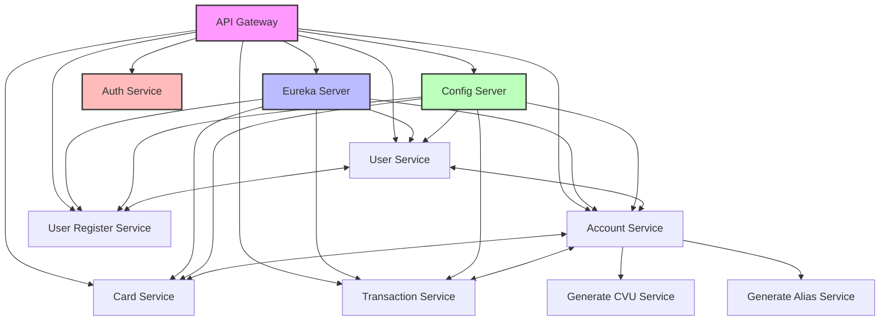
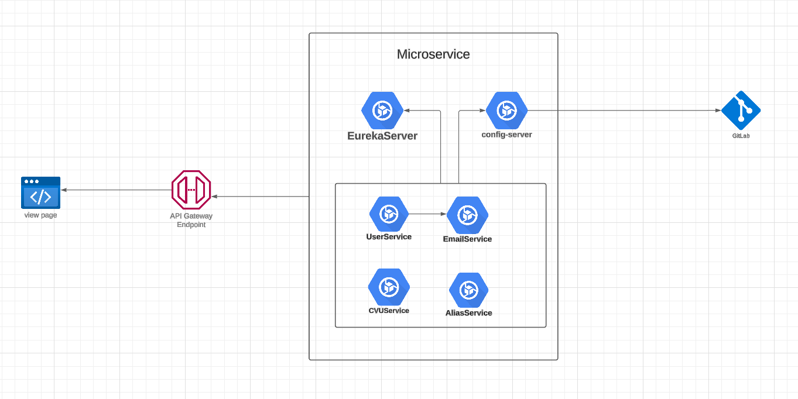

# Desafío Profesional: Digital Money House

## Introducción

El **Desafío Profesional** en Digital House consiste en la creación de una **Rest API** para una billetera virtual llamada **Digital Money House**. Este proyecto es parte integral de la formación y evaluación en la especialización de backend, enfocándose en el desarrollo de una arquitectura de microservicios robusta, segura y escalable. El objetivo es simular un entorno profesional donde se apliquen mejores prácticas de desarrollo, integración continua, y despliegue automatizado.

## Índice

1. [Descripción del Proyecto](#descripción-del-proyecto)
2. [Funcionalidades Esperadas](#funcionalidades-esperadas)
3. [Requisitos del Proyecto por Área](#requisitos-del-proyecto-por-área)
4. [Resultados Esperados](#resultados-esperados)
5. [Sprints](#sprints)
    - [Sprint 1: Registro y Autenticación](#sprint-1-registro-y-autenticación)
    - [Sprint 2: Gestión de Cuentas y Tarjetas](#sprint-2-gestión-de-cuentas-y-tarjetas)
    - [Sprint 3: Transacciones y Actividad de Usuario](#sprint-3-transacciones-y-actividad-de-usuario)
    - [Sprint 4: Transferencias y Testing & Calidad](#sprint-4-transferencias-y-testing--calidad)
6. [Diseño de la Infraestructura](#diseño-de-la-infraestructura)
    - [Infraestructura Propuesta](#infraestructura-propuesta)
    - [Diagrama de Arquitectura](#diagrama-de-arquitectura)
7. [Buenas Prácticas y Recomendaciones](#buenas-prácticas-y-recomendaciones)

## Descripción del Proyecto

El proyecto consiste en desarrollar una **Rest API** para una billetera virtual denominada **Digital Money House**. La plataforma permitirá a los usuarios registrarse, iniciar sesión, gestionar sus medios de pago, consultar su saldo, realizar transferencias de dinero y revisar la actividad de su cuenta. La solución debe estar basada en una arquitectura de microservicios, garantizando escalabilidad, resiliencia y facilidad de mantenimiento.

## Funcionalidades Esperadas

- **Servicio de Registro de Usuario:** Permite a los nuevos usuarios crear una cuenta proporcionando información personal.
- **Servicios de Inicio y Cierre de Sesión:** Autenticación segura mediante JWT, permitiendo a los usuarios iniciar y cerrar sesión.
- **Consulta de Saldo e Información de la Cuenta:** Los usuarios pueden verificar su saldo y detalles de su cuenta.
- **Consulta y Actualización de Datos del Usuario:** Los usuarios pueden ver y actualizar su información personal.
- **Gestión de Medios de Pago:** Administración de tarjetas y otros métodos de pago asociados a la cuenta.
- **Ingreso de Dinero desde Tarjetas a la Billetera:** Permite a los usuarios recargar fondos a su billetera desde tarjetas externas.
- **Actividad del Usuario (Movimientos de Cuenta):** Visualización de transacciones realizadas, con opciones de filtrado y búsqueda.
- **Transferencia de Dinero entre Usuarios y Cuentas Externas:** Facilita el envío de fondos a otros usuarios o cuentas externas.
- **Seguridad y Autorización:** Implementación de controles de acceso para proteger las operaciones sensibles.
- **Documentación de APIs:** Uso de Swagger para documentar y facilitar la interacción con las APIs desarrolladas.

## Requisitos del Proyecto por Área

### Backend Developer

- **Creación de Microservicios:** Desarrollar microservicios utilizando **Java** y **Spring Boot**, cada uno con responsabilidades claras y bien definidas.
- **Construcción de API Rest:** Diseñar y desarrollar APIs Restful utilizando **Spring Boot** y formatos **JSON**.
- **Documentación de APIs:** Implementar documentación automática de las APIs con **Swagger/OpenAPI**.
- **Implementación de Autenticación con JWT:** Utilizar **Spring Security** junto con **JWT** para manejar la autenticación y autorización de usuarios.
- **Conexión a Base de Datos PostgreSQL:** Configurar y conectar los microservicios a una base de datos **PostgreSQL**, asegurando la integridad y consistencia de los datos.
- **Integración con Frontend:** Asegurar la comunicación eficiente con el frontend proporcionado por Digital House mediante **API Gateway**.
- **Uso de MapStruct:** Implementar **MapStruct** para el mapeo eficiente entre DTOs y entidades.
- **Manejo de Excepciones y Validaciones:** Implementar un manejo global de excepciones y validaciones robustas en los controladores y servicios.

### Analista de Base de Datos

- **Modelado de la Base de Datos:** Diseñar un diagrama **DER (Diagrama Entidad-Relación)** que refleje las relaciones y estructuras necesarias para soportar las funcionalidades del proyecto.
- **Implementación de Base de Datos PostgreSQL:** Crear e implementar la base de datos utilizando **PostgreSQL**, optimizando índices y relaciones para mejorar el rendimiento.
- **Documentación de la Base de Datos:** Proporcionar documentación detallada de la estructura de la base de datos, incluyendo scripts de creación y migración (DUMP).

### QA / Analista de Testing

- **Identificación y Notificación de Defectos:** Detectar errores y fallos en las funcionalidades desarrolladas y reportarlos de manera efectiva.
- **Creación de Casos de Prueba:** Diseñar y documentar casos de prueba para pruebas de humo, regresión y funcionales.
- **Automatización de Pruebas:** Implementar pruebas automatizadas utilizando **RestAssured** y **Java**, asegurando la cobertura de las funcionalidades críticas.
- **Pruebas de Integración:** Realizar pruebas que aseguren la correcta interacción entre los diferentes microservicios.

### Analista de Infraestructura

- **Despliegue del Frontend:** Utilizar **Vercel** para el despliegue eficiente del frontend, asegurando accesibilidad y rendimiento.
- **Almacenamiento en AWS S3:** Implementar instancias de **Bucket S3** en **AWS** para el almacenamiento seguro de archivos y activos estáticos.
- **Conexión a Bases de Datos:** Configurar y mantener conexiones seguras y eficientes a las bases de datos proporcionadas.
- **Integración Continua y Despliegue Continuo (CI/CD):** Crear pipelines de **CI/CD** utilizando herramientas como **Jenkins**, **GitHub Actions** o **GitLab CI** para automatizar procesos de construcción, pruebas y despliegue.
- **Gestión de Configuraciones y Secretos:** Utilizar **Spring Cloud Config** y herramientas como **HashiCorp Vault** para gestionar configuraciones y secretos de manera segura.
- **Monitoreo y Logging:** Implementar soluciones de monitoreo y logging centralizado con herramientas como **Prometheus**, **Grafana** y **ELK Stack** para supervisar la salud y rendimiento de los microservicios.

## Resultados Esperados

El objetivo final del proyecto es crear un repositorio **GitLab** que contenga todo el código fuente, documentación y diseño de infraestructura. Además, se debe entregar un documento de proyecto que incluya:

- **Objetivos del Proyecto:** Descripción clara de los objetivos y metas a alcanzar.
- **Planificación y Backlog:** Detalle de las tareas planificadas, organizadas en un backlog con plazos estimados y asignación de sprints.
- **Informes de Entrega:** Documentación de los entregables realizados en cada sprint.
- **Informes de Retroalimentación Personal:** Reflexiones y aprendizajes obtenidos durante el desarrollo del proyecto.
- **Lecciones Aprendidas:** Identificación de desafíos enfrentados y cómo se resolvieron, así como recomendaciones para futuros proyectos.

## Sprints

### Sprint 1: Registro y Autenticación

**Objetivo:** Establecer la base del sistema con funcionalidades esenciales de registro de usuarios y autenticación segura.

**Tareas:**

- **Creación de Servicios:**
    - Desarrollar el **User Service** para gestionar el registro y administración de usuarios.
    - Implementar el **User Register Service** para manejar el registro de nuevos usuarios.
- **Autenticación:**
    - Integrar **Spring Security** con **JWT** para manejar el inicio y cierre de sesión.
    - Proteger los endpoints sensibles mediante mecanismos de autorización.
- **Pruebas Unitarias:**
    - Desarrollar pruebas unitarias para los controladores y servicios utilizando **JUnit** y **Mockito**.
- **Manejo de Errores:**
    - Implementar un manejo global de excepciones utilizando `@ControllerAdvice`.
- **Documentación:**
    - Documentar las APIs desarrolladas utilizando **Swagger**.

### Sprint 2: Gestión de Cuentas y Tarjetas

**Objetivo:** Permitir a los usuarios gestionar sus cuentas y medios de pago, asegurando una integración coherente entre servicios.

**Tareas:**

- **Creación de Servicios:**
    - Desarrollar el **Account Service** para la gestión de cuentas de usuarios.
    - Implementar el **Card Service** para administrar las tarjetas asociadas a las cuentas.
- **Endpoints:**
    - Crear endpoints para la creación, consulta y actualización de cuentas.
    - Desarrollar endpoints para la creación, consulta y eliminación de tarjetas.
- **Integración de Servicios:**
    - Utilizar **Feign Clients** para la comunicación entre **Account Service** y **Card Service**.
- **Validaciones:**
    - Implementar validaciones robustas en los DTOs y entidades.
- **Pruebas de Integración:**
    - Realizar pruebas de integración para asegurar la correcta interacción entre servicios.
- **Documentación:**
    - Actualizar la documentación de las APIs con las nuevas funcionalidades.

### Sprint 3: Transacciones y Actividad de Usuario

**Objetivo:** Implementar funcionalidades para manejar transacciones financieras y permitir a los usuarios revisar su actividad.

**Tareas:**

- **Creación de Servicios:**
    - Desarrollar el **Transaction Service** para gestionar depósitos, transferencias y consultas de transacciones.
- **Endpoints:**
    - Crear endpoints para realizar depósitos y transferencias de dinero.
    - Desarrollar endpoints para consultar la actividad de las cuentas, con opciones de filtrado y búsqueda.
- **Mapeo y Mapeo Automático:**
    - Implementar **MapStruct** para el mapeo entre DTOs y entidades en el **Transaction Service**.
- **Pruebas Unitarias y de Integración:**
    - Desarrollar pruebas unitarias y de integración para asegurar la funcionalidad de las transacciones.
- **Documentación:**
    - Documentar las nuevas APIs y actualizar la documentación existente.
- **Seguridad:**
    - Asegurar que solo usuarios autorizados puedan realizar y consultar transacciones.

### Sprint 4: Transferencias y Testing & Calidad

**Objetivo:** Completar las funcionalidades clave de transferencias y asegurar la calidad del sistema mediante pruebas exhaustivas.

**Tareas:**

- **Transferencias entre Usuarios:**
    - Implementar funcionalidades para transferir dinero entre diferentes usuarios y cuentas externas.
- **Servicios Auxiliares:**
    - Desarrollar los servicios de **Generate CVU** y **Generate Alias** para la identificación de cuentas.
- **Testing y Calidad:**
    - Realizar pruebas de humo, regresión y rendimiento.
    - Implementar automatización de pruebas con **RestAssured**.
- **Manejo de Errores y Resiliencia:**
    - Mejorar el manejo de excepciones y asegurar la resiliencia del sistema mediante patrones como **Circuit Breakers**.
- **Documentación:**
    - Finalizar la documentación de todas las APIs y funcionalidades.
- **Implementación de CI/CD:**
    - Configurar pipelines de **CI/CD** para automatizar la construcción, pruebas y despliegue de los microservicios.
- **Monitoreo y Logging:**
    - Integrar soluciones de monitoreo y logging centralizado para supervisar la salud y rendimiento de los servicios.

## Diseño de la Infraestructura

### Infraestructura Propuesta

- **Arquitectura de Microservicios:**
    - **API Gateway:** Punto de entrada único para todas las solicitudes de los clientes, manejando enrutamiento, balanceo de carga y políticas transversales.
    - **Eureka Server:** Servicio de descubrimiento para registrar y localizar dinámicamente los microservicios.
    - **Config Server:** Gestión centralizada de configuraciones para todos los microservicios.
    - **Microservicios Principales:**
        - **User Service**
        - **Account Service**
        - **Card Service**
        - **Transaction Service**
        - **User Register Service**
        - **Generate CVU Service**
        - **Generate Alias Service**
    - **Servicios Auxiliares:**
        - **Auth Service:** Manejo de autenticación y autorización de usuarios.
- **Almacenamiento:**
    - **Base de Datos PostgreSQL:** Utilizada por cada microservicio para persistencia de datos específicos.
    - **AWS S3 Bucket:** Almacenamiento seguro para archivos y activos estáticos.
- **Contenerización y Orquestación:**
    - **Docker:** Empaquetado de microservicios en contenedores para asegurar consistencia en los entornos.
    - **Kubernetes:** Orquestación de contenedores para facilitar el despliegue, escalabilidad y gestión de los microservicios.
- **Integración Continua y Despliegue Continuo (CI/CD):**
    - **GitLab CI/CD:** Automatización de pipelines para construcción, pruebas y despliegue.
- **Monitoreo y Logging:**
    - **Prometheus y Grafana:** Monitoreo de métricas y visualización del rendimiento del sistema.
    - **ELK Stack (Elasticsearch, Logstash, Kibana):** Logging centralizado para análisis y diagnóstico.
- **Seguridad:**
    - **Spring Security con JWT:** Autenticación y autorización segura para proteger los endpoints de la API.
    - **HashiCorp Vault:** Gestión segura de secretos y credenciales.

### Diagrama de Arquitectura

## Buenas Prácticas y Recomendaciones

### a. **Seguridad**

- **Autenticación y Autorización:**
    - Implementar **Spring Security** con **JWT** para proteger los endpoints de la API.
    - Definir roles y permisos claros para controlar el acceso a las diferentes funcionalidades.
- **Cifrado de Datos Sensibles:**
    - Cifrar datos sensibles como contraseñas y números de tarjetas utilizando algoritmos seguros (e.g., **BCrypt** para contraseñas).
    - Asegurar la comunicación entre servicios mediante **HTTPS**.
- **Gestión de Secretos:**
    - Utilizar **HashiCorp Vault** o **Spring Cloud Config** con cifrado para manejar credenciales y configuraciones sensibles.

### b. **Documentación**

- **Swagger/OpenAPI:**
    - Documentar todas las APIs desarrolladas utilizando **Swagger**, facilitando la interacción y entendimiento por parte de otros desarrolladores.
- **Guías de Desarrollo:**
    - Crear guías que detallen las convenciones de codificación, procesos de revisión y estándares utilizados en el proyecto.

### c. **Pruebas Automatizadas**

- **Pruebas Unitarias:**
    - Desarrollar pruebas unitarias para todos los componentes críticos utilizando **JUnit** y **Mockito**.
- **Pruebas de Integración:**
    - Implementar pruebas de integración para asegurar la correcta interacción entre los microservicios.
- **Automatización de Pruebas:**
    - Utilizar **RestAssured** para automatizar pruebas de las APIs.

### d. **Despliegue y Orquestación**

- **Contenerización:**
    - Empaquetar cada microservicio en contenedores **Docker** para asegurar consistencia en los entornos.
- **Orquestación con Kubernetes:**
    - Implementar **Kubernetes** para gestionar el despliegue, escalabilidad y resiliencia de los microservicios.
- **Pipelines de CI/CD:**
    - Configurar pipelines en **GitLab CI/CD** para automatizar la construcción, pruebas y despliegue de los microservicios.

### e. **Monitoreo y Logging**

- **Monitoreo de Servicios:**
    - Implementar **Prometheus** para la recolección de métricas y **Grafana** para la visualización y monitoreo del rendimiento de los servicios.
- **Logging Centralizado:**
    - Utilizar el **ELK Stack** (Elasticsearch, Logstash, Kibana) para centralizar y analizar logs, facilitando el diagnóstico de problemas.
- **Alertas y Notificaciones:**
    - Configurar alertas para notificar sobre anomalías en el rendimiento o fallos en los servicios.

### f. **Gestión de Configuraciones**

- **Spring Cloud Config:**
    - Centralizar la gestión de configuraciones utilizando **Spring Cloud Config**, permitiendo una configuración coherente y centralizada.
- **Perfilar Configuraciones:**
    - Definir perfiles de Spring (`dev`, `test`, `prod`) para manejar configuraciones específicas de cada entorno.

### g. **Optimización de Base de Datos**

- **Modelado Eficiente:**
    - Diseñar un esquema de base de datos optimizado con índices en campos frecuentemente consultados.
- **Migraciones Controladas:**
    - Utilizar herramientas como **Flyway** o **Liquibase** para gestionar migraciones de base de datos de manera controlada y reproducible.

### h. **Prácticas de Codificación**

- **Consistencia en el Código:**
    - Mantener un estilo de codificación uniforme utilizando herramientas como **Checkstyle** o **SpotBugs**.
- **Revisión de Código:**
    - Implementar revisiones de código mediante **pull requests** para asegurar la calidad y consistencia del código antes de integrarlo en la base de código principal.

### i. **Escalabilidad y Rendimiento**

- **Balanceo de Carga:**
    - Configurar el **API Gateway** y **Eureka Server** para soportar balanceo de carga, permitiendo la escalabilidad horizontal de los microservicios.
- **Caching:**
    - Implementar mecanismos de caching en los microservicios donde sea apropiado para mejorar el tiempo de respuesta y reducir la carga en los servicios backend.
- **Pruebas de Carga:**
    - Realizar pruebas de carga para identificar cuellos de botella y optimizar el rendimiento de los microservicios.

## Conclusión

El **Desafío Profesional: Digital Money House** representa una oportunidad para aplicar y consolidar conocimientos en desarrollo de backend, arquitectura de microservicios, seguridad, pruebas automatizadas y despliegue en la nube. La implementación de este proyecto no solo demostrará habilidades técnicas, sino también la capacidad de gestionar y coordinar diferentes áreas de desarrollo para crear una solución integral y robusta.

**Puntos Clave:**

- **Arquitectura Moderna:** Utilización de una arquitectura de microservicios que facilita la escalabilidad y el mantenimiento.
- **Seguridad:** Implementación de mecanismos robustos de autenticación y autorización para proteger la plataforma.
- **Calidad y Testing:** Enfoque en la calidad del código mediante pruebas unitarias y de integración, así como automatización de pruebas.
- **DevOps y CI/CD:** Adopción de prácticas de DevOps para automatizar el flujo de trabajo de desarrollo, pruebas y despliegue.
- **Monitoreo y Observabilidad:** Integración de herramientas de monitoreo y logging para asegurar la salud y rendimiento continuo del sistema.

Se recomienda seguir las buenas prácticas y recomendaciones mencionadas para asegurar el éxito del proyecto, garantizando una plataforma segura, eficiente y escalable que cumpla con las expectativas de los usuarios y los requisitos del negocio.

¡Éxito en el desarrollo de **Digital Money House** y en la consolidación de tus habilidades profesionales!