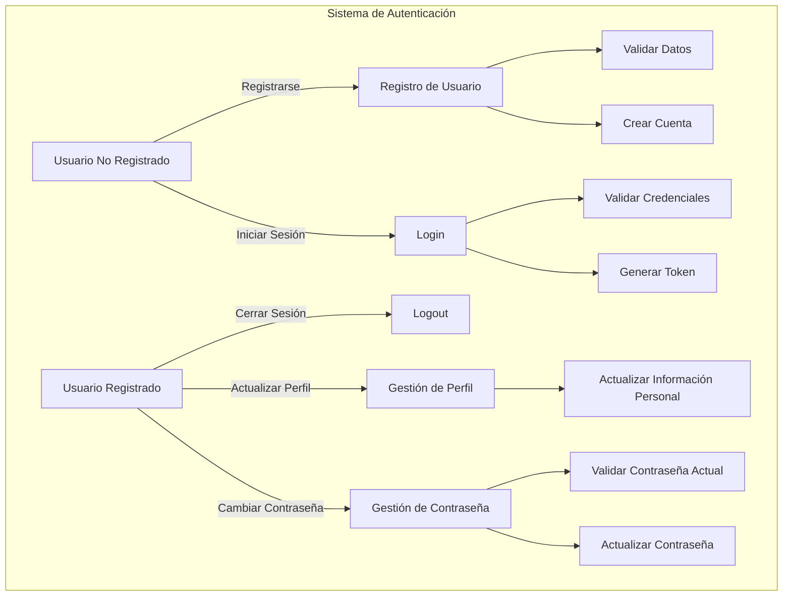
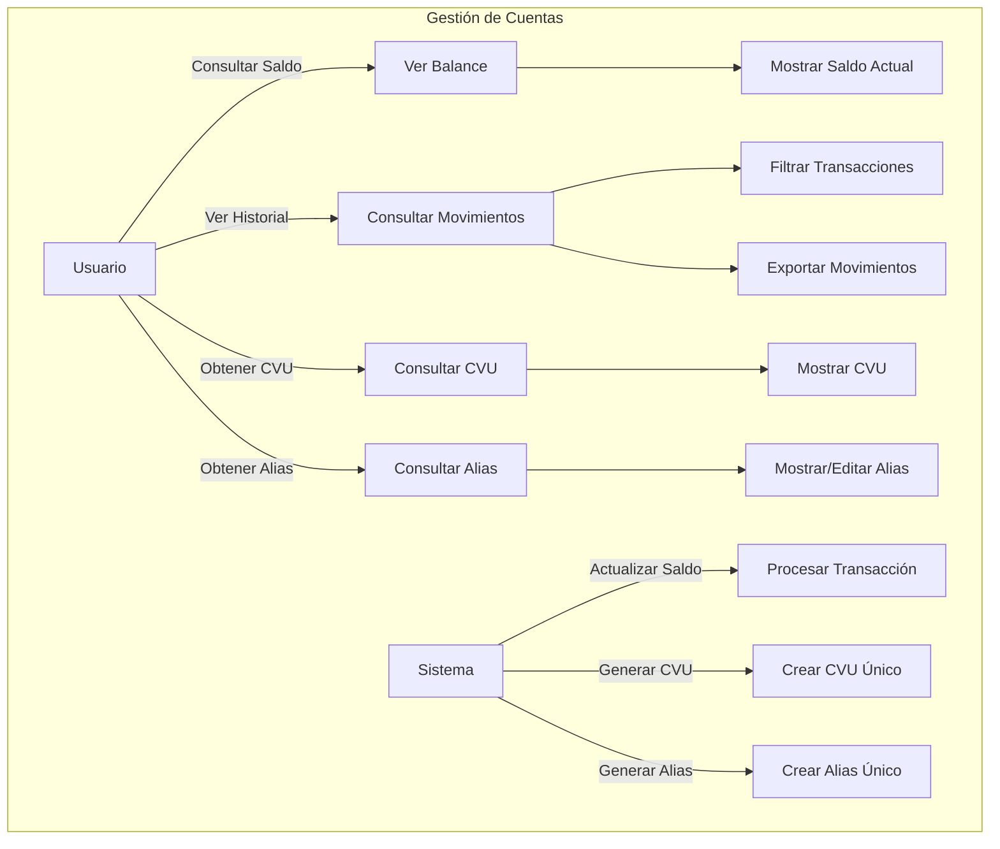
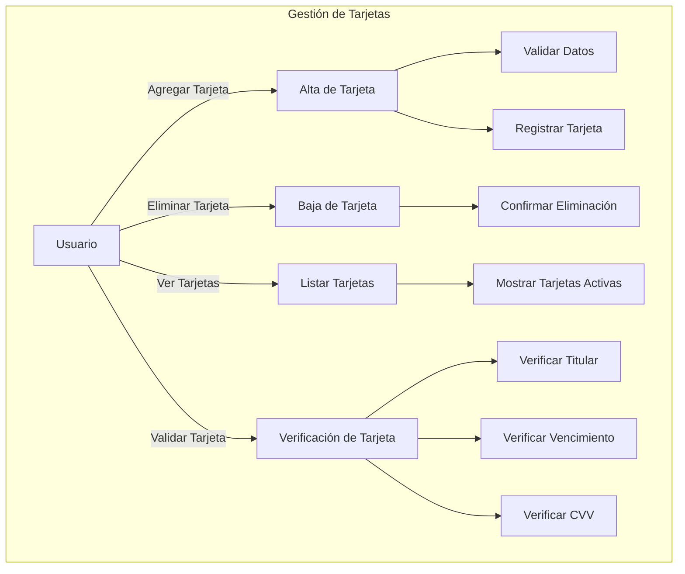
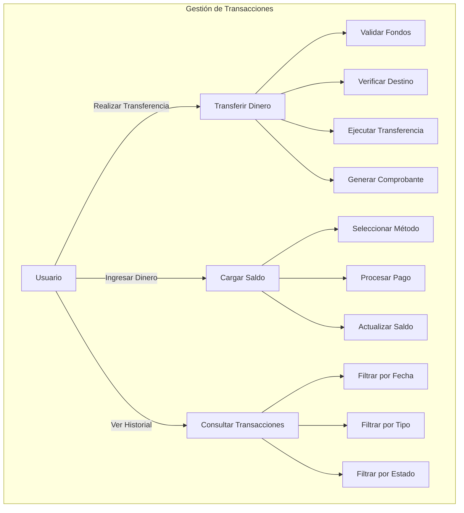
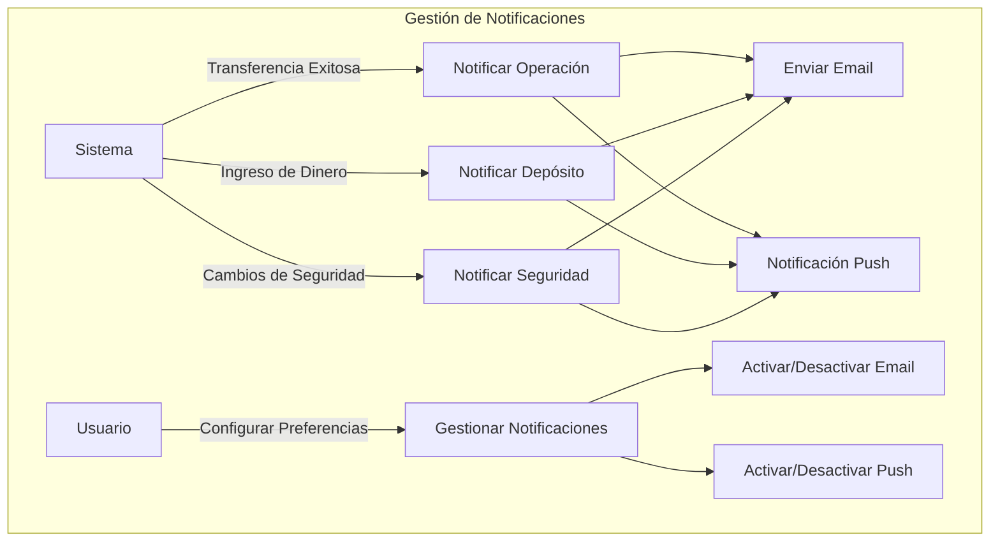
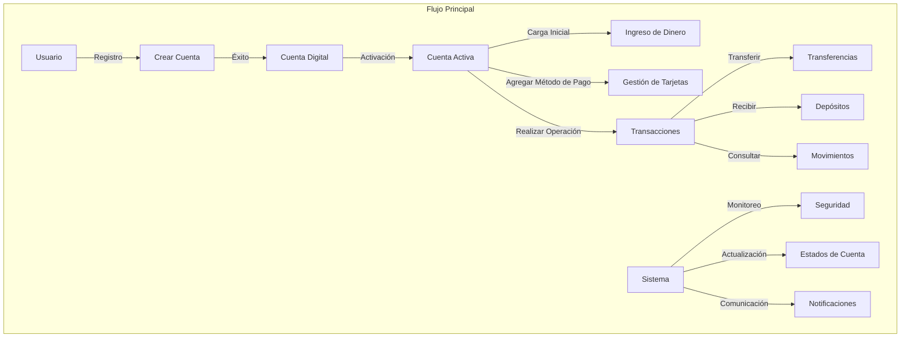
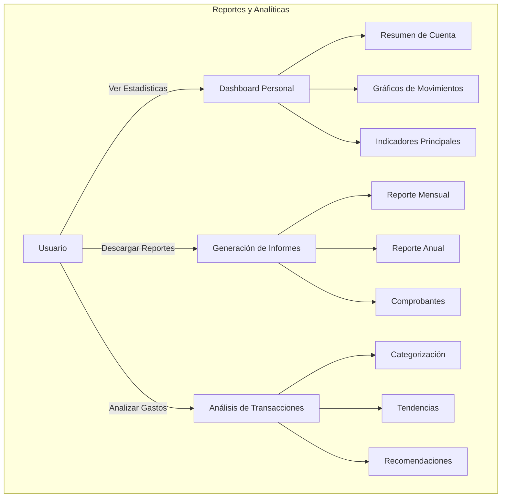
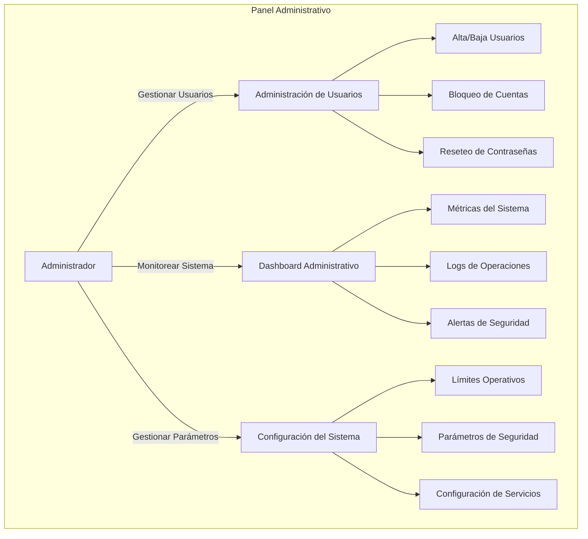

# Diagramas de Casos de Uso - Digital Money House

## 1. Sistema de Autenticación y Usuarios

## 2. Sistema de Cuentas

## 3. Sistema de Tarjetas

## 4. Sistema de Transacciones

## 5. Sistema de Notificaciones

## 6. Flujo General del Sistema

## 7. Sistema de Reportes y Analíticas

## 8. Sistema de Administración

Cada diagrama representa un subsistema específico de Digital Money House, mostrando las interacciones principales entre los usuarios y el sistema. Los diagramas están organizados de manera jerárquica, comenzando con las funcionalidades básicas y progresando hacia operaciones más complejas y específicas.

Las relaciones entre los diferentes casos de uso están representadas mediante flechas, indicando el flujo de las operaciones y las dependencias entre las diferentes funcionalidades. Los actores principales (Usuario, Sistema, Administrador) están claramente identificados, así como las acciones que pueden realizar dentro del sistema.

Estos diagramas proporcionan una vista completa de las funcionalidades del sistema y pueden servir como guía para el desarrollo y la documentación del proyecto. Se pueden expandir o modificar según las necesidades específicas del proyecto y los requerimientos adicionales que surjan durante el desarrollo.