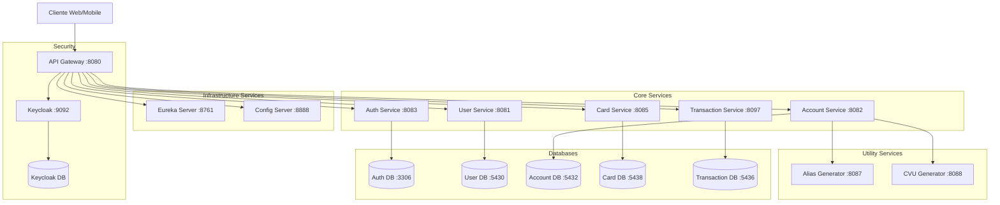

# Digital Money House - Arquitectura de Microservicios

## 1. Visión General de la Arquitectura

### 1.1 Diagrama de Arquitectura



### 1.2 Componentes Principales

1. **API Gateway (Puerto: 8080)**
    - Punto de entrada único para todas las peticiones
    - Manejo de autenticación y autorización con Keycloak
    - Enrutamiento de peticiones a microservicios

2. **Keycloak (Puerto: 9092)**
    - Gestión de identidad y acceso
    - Autenticación OAuth2/OpenID Connect
    - Gestión de usuarios y roles

3. **Servicios Core**:
    - **Auth Service (8083)**: Gestión de autenticación
    - **User Service (8081)**: Gestión de usuarios
    - **Account Service (8082)**: Gestión de cuentas
    - **Card Service (8085)**: Gestión de tarjetas
    - **Transaction Service (8097)**: Gestión de transacciones

4. **Servicios de Infraestructura**:
    - **Eureka Server (8761)**: Descubrimiento de servicios
    - **Config Server (8888)**: Configuración centralizada

5. **Servicios Utilitarios**:
    - **Alias Generator (8087)**: Generación de alias
    - **CVU Generator (8088)**: Generación de CVU

## 2. Correcciones y Mejoras Necesarias

### 2.1 Keycloak

```yaml
# Configuración de Keycloak en application.yml de API Gateway
spring:
  security:
    oauth2:
      resourceserver:
        jwt:
          issuer-uri: http://localhost:9092/realms/dmh
          jwk-set-uri: http://localhost:9092/realms/dmh/protocol/openid-connect/certs

keycloak:
  realm: dmh
  auth-server-url: http://localhost:9092
  resource: gateway-client
  public-client: false
  bearer-only: true
```

#### Configuración del Realm
1. Crear realm "dmh"
2. Configurar clientes:
   ```json
   {
     "clientId": "gateway-client",
     "protocol": "openid-connect",
     "publicClient": false,
     "redirectUris": ["http://localhost:8080/*"],
     "webOrigins": ["+"],
     "authorizationServicesEnabled": true
   }
   ```

### 2.2 Swagger/OpenAPI

```java
@Configuration
public class OpenAPIConfig {
    @Bean
    public OpenAPI customOpenAPI() {
        return new OpenAPI()
                .info(new Info()
                    .title("Digital Money House API")
                    .version("1.0")
                    .description("Digital Money House Financial Services API"))
                .components(new Components()
                    .addSecuritySchemes("bearer-jwt", new SecurityScheme()
                        .type(SecurityScheme.Type.HTTP)
                        .scheme("bearer")
                        .bearerFormat("JWT")))
                .addSecurityItem(new SecurityRequirement().addList("bearer-jwt"));
    }
}
```

### 2.3 Endpoints Faltantes

#### Account Service

```java
@RestController
@RequestMapping("/api/accounts")
public class AccountController {
    @PostMapping
    public ResponseEntity<AccountDto> createAccount(@RequestParam Long userId);
    
    @GetMapping("/{accountId}")
    public ResponseEntity<AccountDto> getAccount(@PathVariable Long accountId);
    
    @GetMapping("/user/{userId}")
    public ResponseEntity<AccountDto> getAccountByUserId(@PathVariable Long userId);
    
    @PatchMapping("/{accountId}/balance")
    public ResponseEntity<AccountDto> updateBalance(
        @PathVariable Long accountId, 
        @RequestBody TransactionRequest request
    );
}
```

#### Card Service

```java
@RestController
@RequestMapping("/api/cards")
public class CardController {
    @PostMapping
    public ResponseEntity<CardDto> createCard(@RequestBody CardRequest request);
    
    @GetMapping("/account/{accountId}")
    public ResponseEntity<List<CardDto>> getCardsByAccountId(@PathVariable Long accountId);
    
    @GetMapping("/{cardId}")
    public ResponseEntity<CardDto> getCard(@PathVariable Long cardId);
    
    @DeleteMapping("/{cardId}")
    public ResponseEntity<Void> deleteCard(@PathVariable Long cardId);
}
```

#### Transaction Service

```java
@RestController
@RequestMapping("/api/transactions")
public class TransactionController {
    @PostMapping("/transfer")
    public ResponseEntity<TransactionDto> createTransfer(@RequestBody TransferRequest request);
    
    @GetMapping("/account/{accountId}")
    public ResponseEntity<List<TransactionDto>> getTransactionsByAccount(
        @PathVariable Long accountId,
        @RequestParam(required = false) LocalDate from,
        @RequestParam(required = false) LocalDate to
    );
    
    @GetMapping("/{transactionId}")
    public ResponseEntity<TransactionDto> getTransaction(@PathVariable Long transactionId);
}
```

## 3. Integración entre Servicios

### 3.1 Feign Clients

```java
@FeignClient(name = "user-service")
public interface UserServiceClient {
    @GetMapping("/api/users/{userId}")
    ResponseEntity<UserDto> getUser(@PathVariable Long userId);
}

@FeignClient(name = "account-service")
public interface AccountServiceClient {
    @GetMapping("/api/accounts/user/{userId}")
    ResponseEntity<AccountDto> getAccountByUserId(@PathVariable Long userId);
}
```

### 3.2 Circuit Breaker con Resilience4j

```java
@CircuitBreaker(name = "userService", fallbackMethod = "getUserFallback")
@Retry(name = "userService")
public UserDto getUser(Long userId) {
    return userServiceClient.getUser(userId);
}

public UserDto getUserFallback(Long userId, Exception ex) {
    log.error("Fallback executed for user {}", userId, ex);
    // Implementar lógica de fallback
    return null;
}
```

## 4. Seguridad

### 4.1 Configuración de Seguridad en Gateway

```java
@Configuration
@EnableWebFluxSecurity
public class SecurityConfig {
    @Bean
    public SecurityWebFilterChain springSecurityFilterChain(ServerHttpSecurity http) {
        return http
            .oauth2ResourceServer(oauth2 -> oauth2
                .jwt(jwt -> jwt.jwtAuthenticationConverter(jwtAuthConverter)))
            .authorizeExchange(exchanges -> exchanges
                .pathMatchers("/api/auth/**").permitAll()
                .pathMatchers("/api/users/**").hasRole("USER")
                .pathMatchers("/api/admin/**").hasRole("ADMIN")
                .anyExchange().authenticated())
            .build();
    }
}
```

### 4.2 Configuración CORS

```java
@Configuration
public class CorsConfig {
    @Bean
    public CorsWebFilter corsFilter() {
        CorsConfiguration config = new CorsConfiguration();
        config.setAllowedOrigins(Arrays.asList("http://localhost:3000"));
        config.setAllowedMethods(Arrays.asList("GET", "POST", "PUT", "DELETE", "OPTIONS"));
        config.setAllowedHeaders(Arrays.asList("*"));
        config.setAllowCredentials(true);
        
        UrlBasedCorsConfigurationSource source = new UrlBasedCorsConfigurationSource();
        source.registerCorsConfiguration("/**", config);
        return new CorsWebFilter(source);
    }
}
```

## 5. Monitoreo y Observabilidad

### 5.1 Actuator

```yaml
management:
  endpoints:
    web:
      exposure:
        include: health,metrics,info,prometheus
  endpoint:
    health:
      show-details: always
  metrics:
    tags:
      application: ${spring.application.name}
```

### 5.2 Logging Centralizado

```xml
<dependency>
    <groupId>net.logstash.logback</groupId>
    <artifactId>logstash-logback-encoder</artifactId>
    <version>7.2</version>
</dependency>
```

```xml
<!-- logback-spring.xml -->
<appender name="LOGSTASH" class="net.logstash.logback.appender.LogstashTcpSocketAppender">
    <destination>localhost:5000</destination>
    <encoder class="net.logstash.logback.encoder.LogstashEncoder"/>
</appender>
```

## 6. Tareas Pendientes

1. **Keycloak**:
    - [ ] Configurar realm "dmh"
    - [ ] Crear roles y permisos
    - [ ] Configurar client scopes
    - [ ] Implementar token exchange

2. **Swagger/OpenAPI**:
    - [ ] Completar documentación de endpoints
    - [ ] Agregar ejemplos de requests/responses
    - [ ] Configurar autenticación en Swagger UI

3. **Seguridad**:
    - [ ] Implementar validación de tokens en todos los servicios
    - [ ] Configurar políticas de contraseñas
    - [ ] Implementar rate limiting

4. **Monitoreo**:
    - [ ] Configurar ELK Stack
    - [ ] Implementar tracing distribuido
    - [ ] Configurar alertas

5. **Testing**:
    - [ ] Implementar pruebas de integración
    - [ ] Configurar pipeline de CI/CD
    - [ ] Implementar pruebas de carga

## 7. Comandos Útiles

```bash
# Levantar servicios con Docker Compose
docker-compose up -d

# Verificar logs
docker-compose logs -f [service-name]

# Acceder a Keycloak
http://localhost:9092/admin
Usuario: admin
Contraseña: admin

# Verificar estado de servicios en Eureka
http://localhost:8761

# Acceder a Swagger UI de cada servicio
http://localhost:[port]/swagger-ui.html
```

## 8. Referencias

1. [Keycloak Documentation](https://www.keycloak.org/documentation)
2. [Spring Cloud Documentation](https://spring.io/projects/spring-cloud)
3. [OpenAPI Specification](https://swagger.io/specification/)
4. [Spring Security OAuth2](https://docs.spring.io/spring-security/reference/servlet/oauth2/index.html)