# Digital Money House - Guía de Despliegue

Digital Money House es una plataforma bancaria digital basada en microservicios. Esta guía le ayudará a desplegar la plataforma utilizando Docker Compose.

## Descarga del Docker Compose

Descargue el archivo de configuración docker-compose.yml desde el siguiente enlace:
https://gitlab.com/atuhome/digital-money-house/-/raw/main/docker-compose.yml

```bash
curl -O https://gitlab.com/atuhome/digital-money-house/-/raw/main/docker-compose.yml
```

## Despliegue

La plataforma utiliza imágenes oficiales disponibles en Docker Hub (https://hub.docker.com/u/atuhome). Para iniciar todos los servicios, simplemente ejecute:

```bash
docker-compose up -d
```

Una vez completado el despliegue, los servicios estarán disponibles en:

- Puerta de enlace principal: http://localhost:8080
- Administración de Keycloak: http://localhost:9092
- Documentación de la API: http://localhost:8080/swagger-ui.html

Comandos útiles:

```bash
# Ver los logs de todos los servicios
docker-compose logs -f

# Detener todos los servicios
docker-compose down
```

## Arquitectura del Sistema


## Casos de Uso

```mermaid
graph TB
   subgraph "Autenticación y Usuarios"
      A1[Usuario No Registrado] -->|Registrarse| B1[Registro]
      A1 -->|Iniciar Sesión| C1[Login]
      B1 --> D1[Validar Datos]
      B1 --> E1[Crear Cuenta]
   end

   subgraph "Gestión de Cuentas"
      A2[Usuario] -->|Ver Balance| B2[Consultar Saldo]
      A2 -->|Ver Movimientos| C2[Historial]
      A2 -->|Obtener CVU| D2[Consultar CVU]
      A2 -->|Obtener Alias| E2[Gestionar Alias]
   end

   subgraph "Gestión de Tarjetas"
      A3[Usuario] -->|Agregar Tarjeta| B3[Alta de Tarjeta]
      A3 -->|Eliminar Tarjeta| C3[Baja de Tarjeta]
      A3 -->|Ver Tarjetas| D3[Listar Tarjetas]
   end

   subgraph "Transacciones"
      A4[Usuario] -->|Transferir| B4[Realizar Transferencia]
      A4 -->|Recibir| C4[Recibir Dinero]
      B4 --> D4[Validar Fondos]
      B4 --> E4[Ejecutar Transferencia]
   end
```



## 👤 Contacto y Soporte

### Alex Velasquez
👨‍💻 Software Developer

📎 LinkedIn: [linkedin.com/in/alex-velasquez08](https://linkedin.com/in/alex-velasquez08)  
🐱 GitHub: [github.com/alex-v08](https://github.com/alex-v08)  
📧 Email: [alex.velasquez08@outlook.com](mailto:alex.velasquez08@outlook.com)